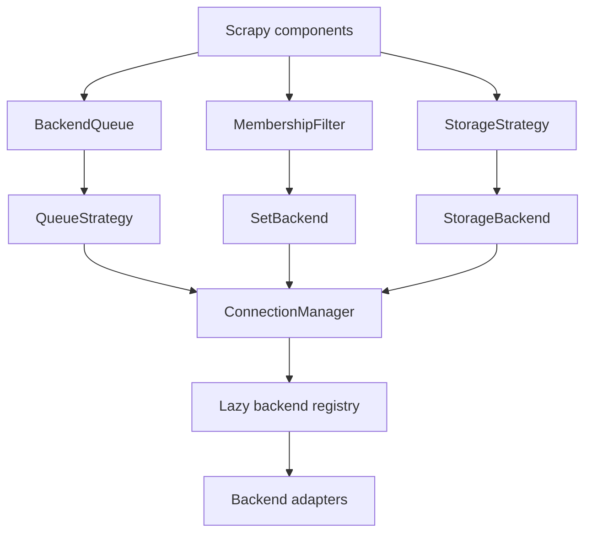

# Current architecture (v1 hardening)

- **Status:** accepted
- **Owner:** maintainers
- **Last updated:** 2026-09-14
- **Related:** [ADR-001](../../01-adrs/0001-multi-backend-architecture.md), [backend API](../../03-api/)

This is the active architecture description. The older
[codebase-deep-insight](codebase-deep-insight.md) document is historical.

## Boundaries

Scrapy-facing components depend on capability interfaces, not concrete clients.
`ConnectionManager` owns backend construction, lazy connect, retry,
circuit-breaker wrapping, and leases. Adapters implement one or more of
`QueueBackend`, `SetBackend`, and `StorageBackend`.

Queue, deduplication, and storage resolve independently, so each may use a
different backend and manager key. Registry entries are dotted paths imported
only after descriptor selection; optional dependencies stay lazy.

## Delivery invariants

Queue pushes use an immutable prepared route. Its commit returns an explicit
durability receipt; only literal `True` permits dependent dedup markers or
source acknowledgement. For deferred-ack queues, `_BoundQueueAckToken` retains
the exact backend object and physical queue that produced a delivery, preventing
manager replacement from misrouting settlement. Ack/nack is single-outcome and
retryable after broker failure. Kafka, RabbitMQ, RocketMQ, SQS, and Pulsar use
per-message tokens; atomic-pop backends need no token.

## Snapshot and failure policy

Delay, time-wheel, and ring-buffer strategies persist process-local state via
generation-addressable, manifest-last snapshots. Restore validates schema,
chunks, and byte limits; corrupt state is skipped so startup remains safe.
Retry, circuit breaking, and backpressure are independent concerns. Boundary
validation covers serialization, key names, TTLs, and item sizes; diagnostics
redact credential-shaped values. Unsupported capabilities fail during factory
setup with `ConfigurationError`.

Changes to ack tokens, durability receipts, manager generation/lease handling,
or snapshot publication require an ADR update and concurrency/restart tests.
